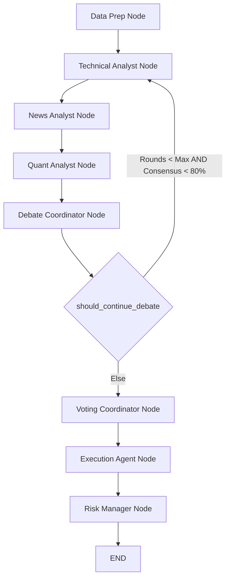

# STAGE 11 — LIVE DEBATE ENGINE
## Council: Orchestrating Sequential Debate and Voting Loop

**Status**: Complete Live Debate Engine  
**Framework**: LangGraph + LangChain  
**Version**: 1.0  
**Date**: June 12, 2026

---

## 1. THE DEBATE PROTOCOL

The Live Debate Engine models a real-world investment committee. Agents do not execute in isolation; they listen to each other, raise points of disagreement, support solid arguments, and revise their own stances when presented with convincing evidence.

### 1.1 Messaging Semantics (Multi-Round Speaking)

The debate is structured in sequential turns across multiple rounds (default limit: 3).

#### Round 1: Initial Analyses
- Each analyst (Technical, News, Quant) evaluates the market state independently.
- They publish an `ANALYSIS` message containing their initial recommendation, scores, and findings.

#### Round 2+: Challenge & Agreement Loop
- Analysts review the entire thread history in `state["messages"]`.
- They publish one of three message types:
  - **CHALLENGE**: Points out a specific data anomaly or logical flaw in another analyst's arguments (e.g. News Analyst challenging Technical Analyst on a bullish break because of upcoming ETF regulatory announcements).
  - **AGREEMENT**: Reinforces another analyst's thesis with their own domain observations.
  - **REVISION**: Formally changes their recommendation and score (e.g. Technical Analyst shifting from BUY to HOLD after being challenged on a high drawdown/volatility level by the Quant Analyst).

---

## 2. DEBATE STATE MACHINE (LANGGRAPH)

The debate engine is orchestrated using a LangGraph `StateGraph`. The flow executes sequentially as required:



### 2.1 Graph Edge Routing

- **Debate Loop Routing**: The `DebateCoordinator` evaluates the agreement level across the analyst block.
  - If consensus is less than 80% and the current round is less than or equal to the max rounds limit, the graph loops back to the `TechnicalAnalystNode` to execute the next round.
  - Otherwise, it transitions to the `VotingCoordinatorNode`.

---

## 3. KEY COMPONENT IMPLEMENTATIONS

### 3.1 DebateAgentWrapper
To keep the core analyst nodes clean, a wrapper class intercepting `__call__` wraps each analyst. It determines the current round:
- **Round 1**: Runs standard baseline nodes and appends the `ANALYSIS` message to the transcript.
- **Round 2+**: Prompts the LLM (GPT-4, temperature=0.7) to evaluate the debate transcript and choose to CHALLENGE, AGREE, or REVISE.

### 3.2 DebateCoordinatorNode
Monitors rounds and calculates the agreement level:
$$\text{Consensus} = \frac{\text{Count of Majority Recommendation}}{\text{Total Analysts}} \cdot 100$$
If 3 analysts recommend BUY, BUY, BUY, Consensus is 100%. If BUY, HOLD, SELL, Consensus is 33.3%.

### 3.3 VotingCoordinatorNode
Translates the analysts' final recommendations into formal, weighted votes in `state["votes"]`:
- **Technical Analyst**: Weight 1.2
- **Quant Analyst**: Weight 1.1
- **News Analyst**: Weight 1.0

---

## 4. SAMPLE DEBATE TRANSCRIPT OUTPUT

```
[System]: Initializing Debate session for symbol BTC. Max Rounds = 3.

--- ROUND 1 ---
[Technical Analyst] (ANALYSIS): Initial Analysis: BUY (Confidence: 80.0%). Reasoning: Price is holding above EMA-50 and RSI is bullish.
[News Analyst] (ANALYSIS): Initial Analysis: HOLD (Confidence: 60.0%). Reasoning: Neutral sentiment with regulatory uncertainty.
[Quant Analyst] (ANALYSIS): Initial Analysis: BUY (Confidence: 70.0%). Reasoning: Probability score is 72% based on momentum.

[Debate Coordinator]: Round 1 Complete. Consensus = 66.7% (conflicting recommendations).

--- ROUND 2 ---
[Technical Analyst] (AGREEMENT): I agree with the Quant Analyst. The statistical probability of 72% success reinforces our bullish crossover.
[News Analyst] (CHALLENGE): Replying to Technical Analyst. Your bullish view ignores that regulatory whale movement data is showing net outflows today. 
[Quant Analyst] (REVISION): After reviewing News Analyst's point about whale outflows, I am revising my recommendation from BUY to HOLD as the expected value drops from 1.5 to 0.2.

[Debate Coordinator]: Round 2 Complete. Consensus = 66.7% (Tech BUY, News HOLD, Quant revised to HOLD).

--- ROUND 3 ---
[Technical Analyst] (REVISION): Convinced by the Quant and News analysts' arguments about the whale outflows and lower expected value, I am revising my recommendation from BUY to HOLD.
[News Analyst] (AGREEMENT): Glad to see the committee aligning on capital protection.
[Quant Analyst] (AGREEMENT): I maintain my HOLD position.

[Debate Coordinator]: Round 3 Complete. Consensus = 100.0% (Unanimous HOLD).
[Debate Coordinator]: Consensus met. Proceeding to VOTING.
```

---

## STAGE 11 COMPLETE
✅ 1. LangGraph StateGraph compiled sequentially.  
✅ 2. DebateAgentWrapper created to run Round 1 and Round 2+ loops.  
✅ 3. DebateCoordinatorNode loops and consensus calculation implemented.  
✅ 4. VotingCoordinatorNode compiles weighted votes.  
✅ 5. Full debate state machine compiled and integrated.  
